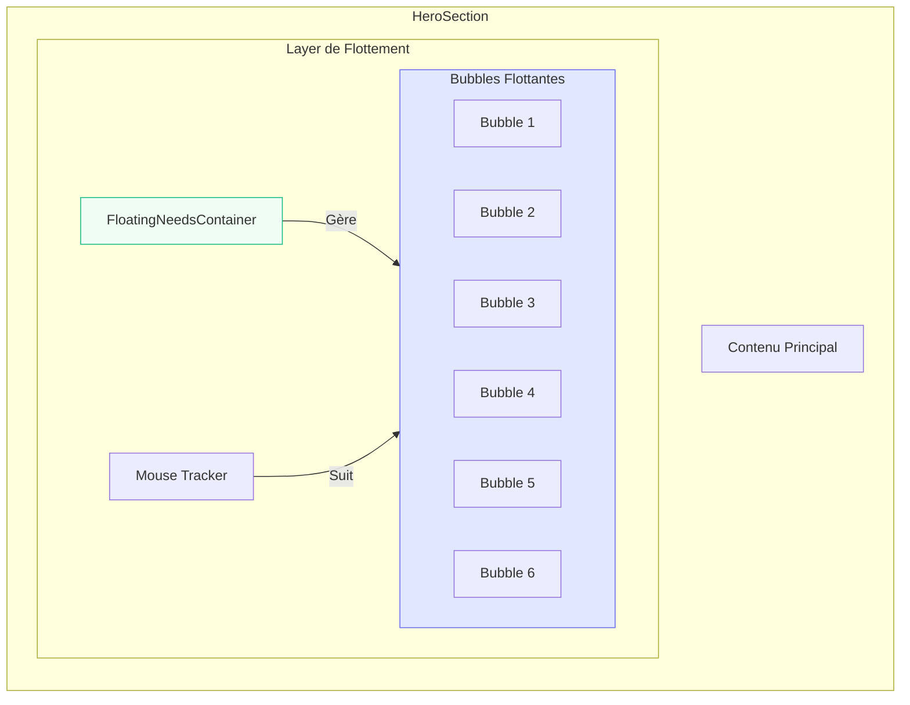

# Plan Technique: Refonte des Needs Bubbles - Section Welcome

## 1. Analyse de l'Existant

### 1.1 Structure Actuelle

- **Emplacement**: [`src/pages/Home/Home.jsx`](src/pages/Home/Home.jsx:898-921), section `{/* Needs Bubbles - SINGLE ROW ON DESKTOP */}`
- **Données**: Tableau [`needsBubbles`](src/pages/Home/Home.jsx:612-709) contenant 6 items
- **Disposition**: `display: flex, flexWrap: wrap, justifyContent: center` - disposition linéaire
- **Composant**: [`BubbleCard`](src/pages/Home/Home.jsx:711-794) - cartes rectangulaires horizontales

### 1.2 Limitations Identifiées

- Les bubbles sont statiques et alignées horizontalement
- Pas d'interaction avec le mouvement de la souris
- Effet de rebond minimal (sur l'icône uniquement)
- Occupation linéaire de l'espace sans création de profondeur

---

## 2. Objectifs de la Refonte

### 2.1 Fonctionnalités Requises

1. **Flottement vivant** - Les bubbles doivent flotter de façon organique dans le background
2. **Réactivité souris** - Interaction avec l'approche et le hover de la souris
3. **Effet de rebond smooth** - Animation fluide lors des interactions
4. **Positionnement non-linéaire** - Distribution aléatoire ou semi-aléatoire dans l'espace

### 2.2 Expérience Utilisateur Cible

- Créer une ambiance vivante et dynamique
- Maintenir la lisibilité et l'accessibilité
- Préserver la fonctionnalité de sélection des besoins

---

## 3. Architecture Technique Proposée

### 3.1 Nouveau Composant: `FloatingNeedsContainer`

```jsx
// Nouveau composant pour gérer le flottement
function FloatingNeedsContainer({ children, onBubbleSelect }) {
  const [bubbles, setBubbles] = useState(initialBubbles);
  const mouseRef = useRef({ x: 0, y: 0 });

  return (
    <div className="floating-bubbles-container">
      {bubbles.map((bubble) => (
        <FloatingBubble
          key={bubble.id}
          data={bubble}
          onSelect={onBubbleSelect}
          mousePosition={mouseRef.current}
        />
      ))}
    </div>
  );
}
```

### 3.2 Composant Amélioré: `FloatingBubble`

```jsx
function FloatingBubble({ data, onSelect, mousePosition }) {
  const bubbleRef = useRef(null);
  const [position, setPosition] = useState(initialPosition);
  const [isHovered, setIsHovered] = useState(false);

  // Animation de flottement de base
  const floatingAnimation = useAnimation();

  // Effet de rebond au hover
  const bounceAnimation = useAnimation();

  return (
    <motion.div
      ref={bubbleRef}
      animate={{ ...floatingAnimation, ...bounceAnimation }}
      onHoverStart={() => {
        setIsHovered(true);
        bounceAnimation.start({
          scale: 1.1,
          y: -10,
          transition: { type: "spring", stiffness: 300, damping: 15 },
        });
      }}
      onHoverEnd={() => {
        setIsHovered(false);
        bounceAnimation.start({
          scale: 1,
          y: 0,
          transition: { type: "spring", stiffness: 200, damping: 20 },
        });
      }}
      style={{ position: "absolute", ...position }}
    >
      {/* Contenu de la bubble */}
    </motion.div>
  );
}
```

### 3.3 Système de Positionnement

#### Option A: Positionnement Aléatoire Controlé

```jsx
function generateRandomPosition(index, viewportWidth, viewportHeight) {
  const padding = 100;
  return {
    x: padding + Math.random() * (viewportWidth - padding * 2),
    y: padding + Math.random() * (viewportHeight - padding * 2),
    rotation: (Math.random() - 0.5) * 20, // Rotation légère
  };
}
```

#### Option B: Grille avec Décalage (Recommandé)

```jsx
function calculateGridPositions(count, containerWidth, containerHeight) {
  const cols = Math.ceil(Math.sqrt(count));
  const rows = Math.ceil(count / cols);
  const cellWidth = containerWidth / cols;
  const cellHeight = containerHeight / rows;

  return positions.map((_, index) => ({
    x: (index % cols) * cellWidth + cellWidth / 2,
    y: Math.floor(index / cols) * cellHeight + cellHeight / 2,
  }));
}
```

### 3.4 Interactions Souris

```jsx
// Hook personnalisé pour le suivi de la souris
function useMouseFollow(containerRef) {
  const [mousePos, setMousePos] = useState({ x: 0, y: 0 });

  useEffect(() => {
    const handleMouseMove = (e) => {
      if (containerRef.current) {
        const rect = containerRef.current.getBoundingClientRect();
        setMousePos({
          x: e.clientX - rect.left,
          y: e.clientY - rect.top,
        });
      }
    };

    window.addEventListener("mousemove", handleMouseMove);
    return () => window.removeEventListener("mousemove", handleMouseMove);
  }, [containerRef]);

  return mousePos;
}
```

---

## 4. Animations Proposées

### 4.1 Animation de Flottement de Base

```css
@keyframes float {
  0%,
  100% {
    transform: translateY(0px) rotate(0deg);
  }
  25% {
    transform: translateY(-15px) rotate(2deg);
  }
  50% {
    transform: translateY(0px) rotate(0deg);
  }
  75% {
    transform: translateY(10px) rotate(-1deg);
  }
}
```

### 4.2 Effet de Rebond au Hover

```css
.bubble {
  transition: transform 0.3s cubic-bezier(0.175, 0.885, 0.32, 1.275);
}

.bubble:hover {
  transform: scale(1.1) translateY(-10px);
}
```

### 4.3 Répulsion Souris (Effet Premium)

```jsx
// Dans le composant FloatingBubble
useFrame(() => {
  if (!bubbleRef.current) return;

  const dx = mousePos.x - position.x;
  const dy = mousePos.y - position.y;
  const distance = Math.sqrt(dx * dx + dy * dy);
  const maxDistance = 150;

  if (distance < maxDistance) {
    const force = (maxDistance - distance) / maxDistance;
    const pushX = (dx / distance) * force * 30;
    const pushY = (dy / distance) * force * 30;

    setPosition({
      ...position,
      x: position.x - pushX,
      y: position.y - pushY,
    });
  }
});
```

---

## 5. Structure des Fichiers

```
src/pages/Home/
├── Home.jsx                    # Page principale (modifications)
├── components/
│   └── FloatingBubbles/
│       ├── index.jsx           # Export principal
│       ├── FloatingBubble.jsx  # Composant bubble individuelle
│       ├── FloatingContainer.jsx # Gestionnaire de layout
│       └── useMouseFollow.js   # Hook souris
└── hooks/
    └── useFloatingAnimation.js # Hook d'animation
```

---

## 6. Modifications du Code Existant

### 6.1 Fichier [`Home.jsx`](src/pages/Home/Home.jsx:898-921)

#### Remplacer la section existante:

```jsx
// AVANT (lignes 898-921)
<div style={{ display: "flex", flexWrap: "wrap", justifyContent: "center", gap: "10px" }}>
  {needsBubbles.map((item, index) => (
    <BubbleCard key={item.id} item={item} index={index} onSelect={...} />
  ))}
</div>

// APRÈS
<FloatingNeedsContainer
  bubbles={needsBubbles}
  onBubbleSelect={(item) => {
    toggleNeed(item);
    scrollToAssistant();
  }}
  containerRef={heroSectionRef}
/>
```

### 6.2 Conservation des Fonctionnalités

- ✅ [`toggleNeed()`](src/pages/Home/Home.jsx:813-822) - Gestion de la sélection
- ✅ [`scrollToAssistant()`](src/pages/Home/Home.jsx:803-811) - Navigation
- ✅ [`needsBubbles`](src/pages/Home/Home.jsx:612-709) - Données existantes

---

## 7. Design Visuel Proposé

### 7.1 Palette de Couleurs

- **Fond**: Blanc/transparent pour laisser passer le background existant
- **Bubbles**: Couleurs existantes préservées
- **Glow effects**: Halo léger autour de chaque bubble

### 7.2 Effets de Profondeur

- Légère ombre portée sur chaque bubble
- Effet de parallaxe avec le scroll
- Mise en avant au hover (z-index)

### 7.3 Responsive Design

- **Desktop**: Positionnement flottant dans tout le container
- **Tablet**: Positionnement avec plus d'espace
- **Mobile**: Layout vertical avec animations réduites

---

## 8. Diagramme d'Architecture



---

## 9. Étapes d'Implémentation

1. **Phase 1**: Créer les nouveaux composants (`FloatingBubble`, `FloatingContainer`)
2. **Phase 2**: Implémenter le système de positionnement
3. **Phase 3**: Ajouter les animations de flottement
4. **Phase 4**: Intégrer les interactions souris
5. **Phase 5**: Tester et optimiser les performances
6. **Phase 6**: Valider sur tous les devices

---

## 10. Considérations de Performance

- **FPS Target**: 60 FPS
- **Optimisations**:
  - Utiliser `useMemo` pour les positions
  - Limiter les re-rendus avec `React.memo`
  - Utiliser `transform: translate3d` pour les animations
  - Éviter les calculs dans `useEffect` si possible
  - Nettoyer les EventListeners

---

## 11. Points de Validation

- [ ] Les bubbles flottent de façon vivante
- [ ] Interaction fluide avec la souris
- [ ] Effet de rebond smooth au hover
- [ ] Fonctionnalité de sélection préservée
- [ ] Responsive sur tous les écrans
- [ ] Accessibilité maintenue (navigation clavier)
