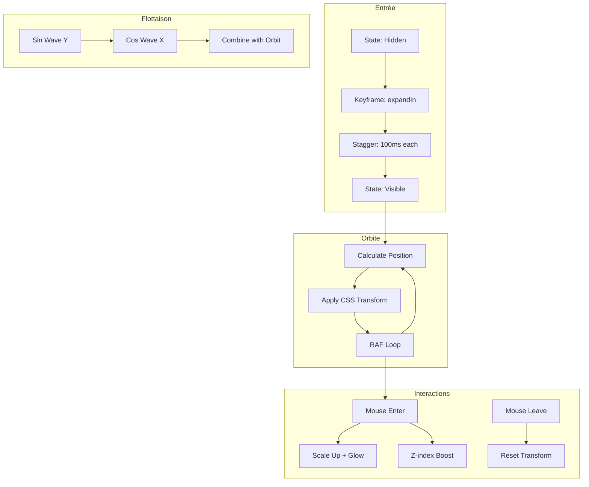

# 📐 Plan d'Implémentation Technique - Orbital Bubbles Refonte

> **Version**: 2.0 | **Date**: 2026-02-08 | **Projet**: STARTERKIT CM

---

## 🎯 Vue d'Ensemble

### Objectif
Refondre completely le système de bubbles orbitales pour créer une expérience utilisateur professionnelle, fluide et moderne.

### Principes Directeurs
- 🎨 **Design System Cohérent** - Palette de couleurs harmonisée
- ✨ **Animations Subtils** - Entrée dramatique, flottaison naturelle
- ♿ **Accessibilité** - WCAG 2.1 AA
- ⚡ **Performance** - 60fps constant
- 📱 **Responsive** - Mobile-first

---

## 📐 1. Design System

### 1.1 Palette de Couleurs

```css
:root {
  /* ========================================
     COULEURS PRINCIPALES - STARTERKIT CM
     ======================================== */
  
  /* Primaire */
  --color-primary: #6366F1;           /* Indigo 500 */
  --color-primary-dark: #4F46E5;      /* Indigo 600 */
  --color-primary-light: rgba(99, 102, 241, 0.15);
  
  /* Secondaire */
  --color-secondary: #10B981;         /* Emerald 500 */
  --color-secondary-dark: #059669;     /* Emerald 600 */
  --color-secondary-light: rgba(16, 185, 129, 0.15);
  
  /* Accent */
  --color-accent: #F59E0B;            /* Amber 500 */
  --color-accent-dark: #D97706;        /* Amber 600 */
  --color-accent-light: rgba(245, 158, 11, 0.15);
  
  /* Fond */
  --bg-primary: #FFFFFF;
  --bg-secondary: #F8FAFC;            /* Slate 50 */
  --bg-tertiary: #F1F5F9;             /* Slate 100 */
  
  /* Texte */
  --text-primary: #0F172A;            /* Slate 900 */
  --text-secondary: #475569;          /* Slate 600 */
  --text-tertiary: #94A3B8;           /* Slate 400 */
  
  /* Système de catégories */
  --category-sensibiliser: #8B5CF6;   /* Violet */
  --category-reseau: #10B981;         /* Emerald */
  --category-equipe: #EC4899;         /* Pink */
  --category-activite: #06B6D4;       /* Cyan */
  --category-probleme: #F97316;       /* Orange */
  --category-autrement: #EF4444;      /* Red */
  --category-entreprise: #14B8A6;     /* Teal */
  --category-certifier: #EAB308;      /* Yellow */
  --category-financement: #22C55E;    /* Green */
  --category-distribution: #3B82F6;   /* Blue */
  --category-mentor: #A855F7;          /* Purple */
  --category-formation: #0EA5E9;       /* Sky */
  
  /* Ombres */
  --shadow-sm: 0 1px 2px 0 rgba(0, 0, 0, 0.05);
  --shadow-md: 0 4px 6px -1px rgba(0, 0, 0, 0.1);
  --shadow-lg: 0 10px 15px -3px rgba(0, 0, 0, 0.1);
  --shadow-xl: 0 20px 25px -5px rgba(0, 0, 0, 0.1);
  --shadow-glow: 0 0 40px rgba(99, 102, 241, 0.3);
}
```

### 1.2 Typographie

```css
:root {
  /* Font family */
  --font-primary: 'Inter', system-ui, -apple-system, sans-serif;
  
  /* Scale typographique */
  --text-xs: 0.75rem;     /* 12px */
  --text-sm: 0.875rem;    /* 14px */
  --text-base: 1rem;      /* 16px */
  --text-lg: 1.125rem;    /* 18px */
  --text-xl: 1.25rem;     /* 20px */
  --text-2xl: 1.5rem;     /* 24px */
  --text-3xl: 1.875rem;   /* 30px */
  --text-4xl: 2.25rem;    /* 36px */
  
  /* Line heights */
  --leading-tight: 1.25;
  --leading-normal: 1.5;
  --leading-relaxed: 1.75;
  
  /* Font weights */
  --weight-normal: 400;
  --weight-medium: 500;
  --weight-semibold: 600;
  --weight-bold: 700;
  --weight-extrabold: 800;
}
```

### 1.3 Système d'Icônes

```javascript
// Mapping icônes professionnelles (Lucide React ou Phosphor Icons)

const bubblesConfig = [
  {
    id: 'sensibiliser',
    title: 'Sensibiliser',
    icon: 'Lightbulb',              // vs 💡
    color: 'var(--category-sensibiliser)',
    category: 'awareness'
  },
  {
    id: 'reseau',
    title: 'Réseau',
    icon: 'Users',                  // vs 👥
    color: 'var(--category-reseau)',
    category: 'community'
  },
  {
    id: 'equipe',
    title: 'Équipe',
    icon: 'UserPlus',               // vs ➪
    color: 'var(--category-equipe)',
    category: 'team'
  },
  {
    id: 'activite',
    title: 'Activité',
    icon: 'TrendingUp',             // vs 📈
    color: 'var(--category-activite)',
    category: 'growth'
  },
  {
    id: 'probleme',
    title: 'Problème',
    icon: 'AlertCircle',            // vs ⚖️
    color: 'var(--category-probleme)',
    category: 'challenge'
  },
  {
    id: 'autrement',
    title: 'Autrement',
    icon: 'Sparkles',               // vs 🚀
    color: 'var(--category-autrement)',
    category: 'innovation'
  },
  {
    id: 'entreprise',
    title: 'Entreprise',
    icon: 'Building2',              // vs 🏢
    color: 'var(--category-entreprise)',
    category: 'business'
  },
  {
    id: 'certifier',
    title: 'Certifier',
    icon: 'Award',                  // vs 📜
    color: 'var(--category-certifier)',
    category: 'certification'
  },
  {
    id: 'financement',
    title: 'Financement',
    icon: 'PiggyBank',              // vs 💰
    color: 'var(--category-financement)',
    category: 'funding'
  },
  {
    id: 'distribution',
    title: 'Distribution',
    icon: 'Truck',                   // vs 🚚
    color: 'var(--category-distribution)',
    category: 'logistics'
  },
  {
    id: 'mentor',
    title: 'Mentor',
    icon: 'GraduationCap',          // vs 🎓
    color: 'var(--category-mentor)',
    category: 'guidance'
  },
  {
    id: 'formation',
    title: 'Formation',
    icon: 'BookOpen',                // vs 📚
    color: 'var(--category-formation)',
    category: 'education'
  }
];
```

---

## ⚙️ 2. Architecture Technique

### 2.1 Structure de Composants

```
src/
├── components/
│   ├── orbital/
│   │   ├── OrbitalBubbles.jsx      # Container principal
│   │   ├── OrbitalBubble.jsx       # Composant bulle individuelle
│   │   ├── BubbleOrbitPath.jsx     # SVG chemin orbital
│   │   └── useOrbitalAnimation.js  # Hook animation
│   ├── central/
│   │   ├── CentralContent.jsx      # Contenu central
│   │   ├── WelcomeMessage.jsx      # Message d'accueil
│   │   └── CTAContainer.jsx        # Boutons d'action
│   └── ui/
│       ├── Icon.jsx                # Wrapper icônes
│       ├── Button.jsx              # Boutons stylisés
│       └── Tooltip.jsx             # Info-bulle
├── hooks/
│   ├── useMousePosition.js
│   ├── useReducedMotion.js
│   └── useWindowSize.js
├── utils/
│   ├── geometry.js                  # Calculs orbitaux
│   ├── animationPresets.js         # Config animations
│   └── accessibility.js
└── styles/
    ├── variables.css              # Design tokens
    ├── orbital-bubbles.css        # Styles composants
    └── animations.css             # Keyframes
```

### 2.2 Architecture d'Animation



---

## 🔧 3. Implémentation Détaillée

### 3.1 Composant Principal

```jsx
// OrbitalBubbles.jsx

import { useState, useEffect, useRef, useCallback } from 'react';
import { motion, AnimatePresence } from 'framer-motion';
import { useMousePosition, useReducedMotion } from '@/hooks';
import { OrbitalBubble } from './OrbitalBubble';
import { bubblesConfig } from '@/data/bubbles.config';
import './orbital-bubbles.css';

export function OrbitalBubbles() {
  const containerRef = useRef(null);
  const [isReady, setIsReady] = useState(false);
  const mousePos = useMousePosition();
  const prefersReducedMotion = useReducedMotion();
  
  // Dimensions et calculs orbitaux
  const [dimensions, setDimensions] = useState({
    centerX: 0,
    centerY: 0,
    maxRadius: 0
  });
  
  useEffect(() => {
    const updateDimensions = () => {
      if (!containerRef.current) return;
      
      const rect = containerRef.current.getBoundingClientRect();
      setDimensions({
        centerX: rect.width / 2,
        centerY: rect.height / 2,
        maxRadius: Math.min(rect.width, rect.height) * 0.42
      });
    };
    
    updateDimensions();
    window.addEventListener('resize', updateDimensions);
    return () => window.removeEventListener('resize', updateDimensions);
  }, []);
  
  // Animation d'entrée
  useEffect(() => {
    const timer = setTimeout(() => setIsReady(true), 100);
    return () => clearTimeout(timer);
  }, []);
  
  return (
    <div ref={containerRef} className="orbital-bubbles-container">
      {/* Grille de fond */}
      <BackgroundGrid />
      
      {/* Orbs décoratifs */}
      <OrbGlow color="var(--color-primary)" position="top-right" />
      <OrbGlow color="var(--color-secondary)" position="bottom-left" />
      
      {/* Bulles orbitales */}
      <AnimatePresence mode="wait">
        {isReady && (
          <OrbitalSystem
            bubbles={bubblesConfig}
            dimensions={dimensions}
            mousePos={mousePos}
            reducedMotion={prefersReducedMotion}
          />
        )}
      </AnimatePresence>
      
      {/* Contenu central */}
      <CentralContent />
      
      {/* Instructions */}
      {!prefersReducedMotion && <OrbitalInstructions />}
    </div>
  );
}
```

### 3.2 Système d'Animation Unifié

```javascript
// useOrbitalAnimation.js

import { useRef, useEffect, useCallback } from 'react';

export function useOrbitalAnimation(
  config = {
    orbitSpeed: 0.0003,
    floatAmplitude: 12,
    floatFrequency: 0.001,
    repelRadius: 120,
    repelStrength: 30
  }
) {
  const animationRef = useRef(null);
  const stateRef = useRef({
    time: 0,
    positions: [],
    velocities: []
  });
  
  const animate = useCallback((timestamp) => {
    const { time } = stateRef.current;
    
    // Calcul unifié de position
    const calculatePosition = (bubble, index) => {
      // Orbite principale
      const orbitAngle = (index / 12) * Math.PI * 2 + (time * config.orbitSpeed);
      const orbitRadius = config.baseRadius + Math.sin(time * 0.0005) * 20;
      
      // Flottaison douce
      const floatOffset = {
        x: Math.sin(time * config.floatFrequency + index * 0.5) * config.floatAmplitude,
        y: Math.cos(time * config.floatFrequency * 0.8 + index * 0.3) * (config.floatAmplitude * 0.6)
      };
      
      // Position finale
      return {
        x: config.centerX + Math.cos(orbitAngle) * orbitRadius + floatOffset.x,
        y: config.centerY + Math.sin(orbitAngle) * orbitRadius + floatOffset.y
      };
    };
    
    stateRef.current.time = timestamp;
    animationRef.current = requestAnimationFrame(animate);
    
    return calculatePosition;
  }, [config]);
  
  useEffect(() => {
    animationRef.current = requestAnimationFrame(animate);
    return () => {
      if (animationRef.current) {
        cancelAnimationFrame(animationRef.current);
      }
    };
  }, [animate]);
  
  return {
    getPosition: (bubble, index) => {
      const calculatePosition = useOrbitalAnimation.getCalculatePosition();
      return calculatePosition(bubble, index);
    }
  };
}
```

### 3.3 CSS Animations Optimisé

```css
/* animations.css */

/* ========================================
   ENTRÉE - Staggered Reveal
   ======================================== */
@keyframes orbitalEnter {
  0% {
    opacity: 0;
    transform: translateY(100px) scale(0.5);
  }
  60% {
    transform: translateY(-10px) scale(1.1);
  }
  100% {
    opacity: 1;
    transform: translateY(0) scale(1);
  }
}

@keyframes orbitalSpin {
  from { transform: rotate(0deg); }
  to { transform: rotate(360deg); }
}

@keyframes floatVertical {
  0%, 100% { transform: translateY(0); }
  50% { transform: translateY(-8px); }
}

@keyframes pulseGlow {
  0%, 100% { box-shadow: 0 0 20px var(--glow-color); }
  50% { box-shadow: 0 0 40px var(--glow-color); }
}

/* ========================================
   INTERACTIONS - Hover States
   ======================================== */
.orbital-bubble {
  --bubble-size: 72px;
  --transition-elastic: cubic-bezier(0.34, 1.56, 0.64, 1);
  
  width: var(--bubble-size);
  height: var(--bubble-size);
  border-radius: 50%;
  transition: all 0.4s var(--transition-elastic);
  
  /* Performance optimization */
  will-change: transform, box-shadow;
  transform: translateZ(0);
  backface-visibility: hidden;
}

.orbital-bubble:hover {
  transform: scale(1.15) translateY(-24px);
  box-shadow: 
    0 20px 40px rgba(0, 0, 0, 0.15),
    0 0 30px var(--glow-color);
  z-index: 100;
}

/* ========================================
   RESPONSIVE - Mobile Adjustments
   ======================================== */
@media (max-width: 768px) {
  .orbital-bubble {
    --bubble-size: 56px;
  }
  
  .orbital-bubble:hover {
    transform: scale(1.1) translateY(-12px);
  }
}

@media (prefers-reduced-motion: reduce) {
  .orbital-bubble,
  .orbital-bubble *,
  [class*="orbital"] {
    animation: none !important;
    transition: none !important;
  }
}
```

---

## 📐 4. Calculs Mathématiques

### 4.1 Positionnement Symétrique

```javascript
// geometry.js

/**
 * Calcule les positions orbitales symétriques pour N bulles
 */
export function calculateSymmetricalPositions(
  count,
  options = {
    centerX: 0,
    centerY: 0,
    baseRadius: 150,
    radiusVariation: 0,
    startAngle: 0,
    clockwise: true
  }
) {
  const positions = [];
  const angleStep = (2 * Math.PI) / count;
  
  for (let i = 0; i < count; i++) {
    const angle = options.startAngle + (i * angleStep * (options.clockwise ? 1 : -1));
    const radius = options.baseRadius + options.radiusVariation * Math.sin(i * angleStep * 3);
    
    positions.push({
      id: i,
      angle,
      radius,
      x: options.centerX + Math.cos(angle) * radius,
      y: options.centerY + Math.sin(angle) * radius
    });
  }
  
  return positions;
}

/**
 * Vérifie et corrige les positions hors-bords
 */
export function constrainToBounds(position, bounds) {
  const padding = 40; // Marge de sécurité
  return {
    x: Math.max(padding, Math.min(bounds.width - padding, position.x)),
    y: Math.max(padding, Math.min(bounds.height - padding, position.y))
  };
}

/**
 * Calcule la distance entre deux points
 */
export function distance(p1, p2) {
  return Math.sqrt(Math.pow(p2.x - p1.x, 2) + Math.pow(p2.y - p1.y, 2));
}
```

### 4.2 Animation de Flottaison

```javascript
// floatAnimation.js

/**
 * Génère une courbe de flottaison naturelle
 */
export function createFloatPath(
  basePosition,
  options = {
    amplitudeX: 8,
    amplitudeY: 12,
    frequencyX: 0.001,
    frequencyY: 0.0008,
    phase: 0,
    timeOffset: 0
  }
) {
  return (timestamp) => {
    const t = timestamp + options.timeOffset;
    
    return {
      x: basePosition.x + Math.sin(t * options.frequencyX + options.phase) * options.amplitudeX,
      y: basePosition.y + Math.cos(t * options.frequencyY + options.phase) * options.amplitudeY
    };
  };
}

/**
 * Ease-in-out pour transitions douces
 */
export function easeInOutSine(t) {
  return -(Math.cos(Math.PI * t) - 1) / 2;
}
```

---

## 🎨 5. Design Visuel Détaillé

### 5.1 Structure des Bulles

```
┌─────────────────────────────────────┐
│         ORBITAL BUBBLE              │
│                                     │
│    ┌─────────────────────────┐      │
│    │                         │      │
│    │    ┌─────────────┐      │      │
│    │    │    ICON     │ 24px │      │
│    │    │             │      │      │
│    │    └─────────────┘      │      │
│    │                         │      │
│    │  ┌─────────────────┐    │      │
│    │  │    TITLE       │    │      │
│    │  │    10px Bold   │    │      │
│    │  └─────────────────┘    │      │
│    │                         │      │
│    └─────────────────────────┘      │
│                                     │
│   ─────────────────────────────     │
│   Gradient: color-light → transparent│
│   Border: 2px solid color (opacity 0.3)│
│   Shadow: 0 8px 32px rgba(0,0,0,0.12)│
└─────────────────────────────────────┘
```

### 5.2 Design Responsive

```css
/* Mobile First */
.orbital-bubbles-container {
  --container-padding: 24px;
  --bubble-size: 56px;
  --icon-size: 20px;
  --title-size: 9px;
}

@media (min-width: 768px) {
  .orbital-bubbles-container {
    --container-padding: 48px;
    --bubble-size: 72px;
    --icon-size: 28px;
    --title-size: 10px;
  }
}

@media (min-width: 1280px) {
  .orbital-bubbles-container {
    --container-padding: 64px;
    --bubble-size: 80px;
    --icon-size: 32px;
    --title-size: 11px;
  }
}
```

---

## ♿ 6. Accessibilité

### 6.1 Checklist WCAG 2.1 AA

```javascript
const accessibilityConfig = {
  // Contraste
  minimumContrast: 4.5,
  
  // Focus visible
  focusVisible: {
    outline: '2px solid var(--color-primary)',
    outlineOffset: '2px'
  },
  
  // reducedMotion
  reducedMotion: {
    duration: '0.01ms',
    animated: false
  },
  
  // Clavier navigable
  keyboardNavigable: true,
  
  // Screen reader
  srOnly: {
    title: true,
    description: true,
    instructions: true
  }
};
```

### 6.2 Implémentation

```jsx
export function OrbitalBubble({ bubble, index }) {
  const [isFocused, setIsFocused] = useState(false);
  
  return (
    <motion.div
      className="orbital-bubble"
      style={{
        '--bubble-color': bubble.color,
        '--glow-color': bubble.color
      }}
      tabIndex={0}
      role="button"
      aria-label={`${bubble.title}: ${bubble.category}`}
      aria-describedby="orbital-instructions"
      onFocus={() => setIsFocused(true)}
      onBlur={() => setIsFocused(false)}
      whileHover={{ scale: isFocused ? 1 : 1.15 }}
      whileTap={{ scale: 0.95 }}
    >
      <span className="sr-only">
        {bubble.title}, catégorie {bubble.category}
      </span>
      
      <Icon name={bubble.icon} size="var(--icon-size)" />
      
      <span className="bubble-title" aria-hidden="true">
        {bubble.title}
      </span>
    </motion.div>
  );
}
```

---

## ⚡ 7. Performance

### 7.1 Optimisations

```javascript
// useOrbitalAnimation.js

export function useOrbitalAnimationOptimized() {
  // 1. Une seule boucle RAF pour toutes les bulles
  // 2. CSS transforms (GPU acceleration)
  // 3. will-change hints
  // 4. RequestAnimationFrame throttled
  
  const frameRef = useRef(0);
  const lastFrameTime = useRef(0);
  const FPS_LIMIT = 60;
  
  const animate = useCallback((timestamp) => {
    const delta = timestamp - lastFrameTime.current;
    
    if (delta >= 1000 / FPS_LIMIT) {
      lastFrameTime.current = timestamp - (delta % (1000 / FPS_LIMIT));
      
      // Mise à jour de TOUTES les bulles en une passe
      updateAllBubbles(timestamp);
    }
    
    frameRef.current = requestAnimationFrame(animate);
  }, []);
  
  return { animate, stop: () => cancelAnimationFrame(frameRef.current) };
}
```

### 7.2 Liste de Vérification Performance

- [ ] **GPU Acceleration**: `transform: translate3d()` sur toutes les animations
- [ ] **Will-change**: Pré-déclarer les propriétés animées
- [ ] **Debounce Resize**: 250ms debounce sur window resize
- [ ] **Virtualisation**: Pas nécessaire (seulement 12 éléments)
- [ ] **Memory**: Nettoyer les animations au unmount
- [ ] **Bundle**: Tree-shaking des icônes

---

## 📱 8. Responsive Breakpoints

```css
/* ========================================
   BREAKPOINTS - Mobile First
   ======================================== */

/* Mobile Portrait < 480px */
@media (max-width: 479px) {
  .orbital-bubbles-container {
    --bubble-size: 48px;
    --orbit-multiplier: 0.25;
    --show-titles: none; /* Masquer titres sur très petit écran */
  }
}

/* Mobile Landscape / Small Tablet 480-767px */
@media (min-width: 480px) and (max-width: 767px) {
  .orbital-bubbles-container {
    --bubble-size: 56px;
    --orbit-multiplier: 0.32;
    --show-titles: inline;
  }
}

/* Tablet 768-1023px */
@media (min-width: 768px) and (max-width: 1023px) {
  .orbital-bubbles-container {
    --bubble-size: 64px;
    --orbit-multiplier: 0.38;
  }
}

/* Desktop 1024-1279px */
@media (min-width: 1024px) and (max-width: 1279px) {
  .orbital-bubbles-container {
    --bubble-size: 72px;
    --orbit-multiplier: 0.42;
  }
}

/* Large Desktop 1280px+ */
@media (min-width: 1280px) {
  .orbital-bubbles-container {
    --bubble-size: 80px;
    --orbit-multiplier: 0.45;
  }
}
```

---

## 🧪 9. Tests

### 9.1 Tests Recommandés

```javascript
// orbital.test.js

describe('OrbitalBubbles', () => {
  describe('Positionnement', () => {
    test('toutes les bulles sont dans les bounds', () => {
      const positions = calculateSymmetricalPositions(12, {
        centerX: 400,
        centerY: 300,
        baseRadius: 150
      });
      
      positions.forEach(pos => {
        expect(pos.x).toBeGreaterThanOrEqual(0);
        expect(pos.x).toBeLessThanOrEqual(800);
        expect(pos.y).toBeGreaterThanOrEqual(0);
        expect(pos.y).toBeLessThanOrEqual(600);
      });
    });
    
    test('les bulles sont symétriquement espacées', () => {
      const positions = calculateSymmetricalPositions(12, {
        centerX: 400,
        centerY: 300,
        baseRadius: 150
      });
      
      const angles = positions.map(p => p.angle);
      const expectedAngle = Math.PI / 6; // 30 degrees
      
      angles.forEach((angle, i) => {
        if (i < 11) {
          expect(Math.abs(angle - angles[i + 1])).toBeCloseTo(expectedAngle, 1);
        }
      });
    });
  });
  
  describe('Animations', () => {
    test('pas de crash avec reduced motion', () => {
      const { container } = render(<OrbitalBubbles />);
      expect(container.querySelector('.orbital-bubble')).toBeInTheDocument();
    });
  });
});
```

---

## 📦 10. Dépendances Recommandées

```json
{
  "dependencies": {
    "framer-motion": "^10.0.0",
    "lucide-react": "^0.294.0",
    "react": "^18.2.0"
  },
  "devDependencies": {
    "eslint-plugin-jsx-a11y": "^6.8.0",
    "@testing-library/react": "^14.0.0",
    "axe-core": "^4.8.0"
  }
}
```

---

## 🚀 11. Phases d'Implémentation

### Phase 1: Fondations (Semaine 1)
- [ ] Setup Design System CSS
- [ ] Configuration des icônes Lucide
- [ ] Composant OrbitalBubble basique
- [ ] Animation d'entrée

### Phase 2: Moteur Orbital (Semaine 2)
- [ ] Calculs mathématiques
- [ ] Animation orbitale continue
- [ ] Flottaison naturelle
- [ ] Interactions souris

### Phase 3: Polish (Semaine 3)
- [ ] Responsive complet
- [ ] Accessibilité WCAG
- [ ] Optimisations performance
- [ ] Tests unitaires

---

*Document généré le 2026-02-08 pour STARTERKIT CM*
